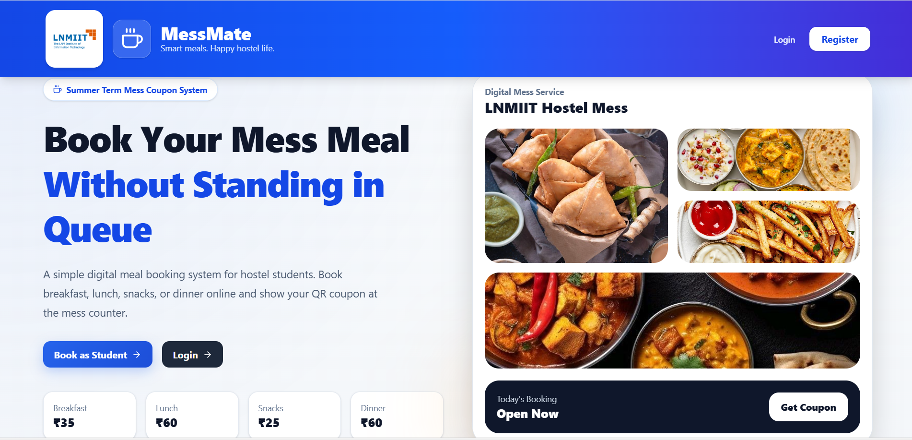
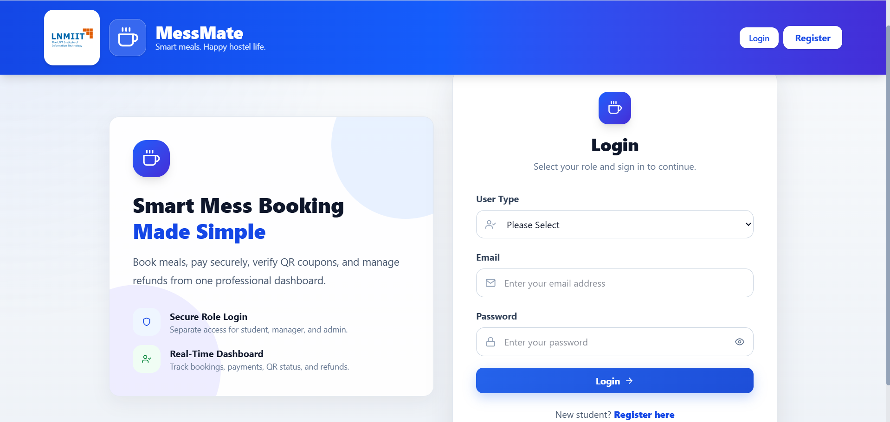
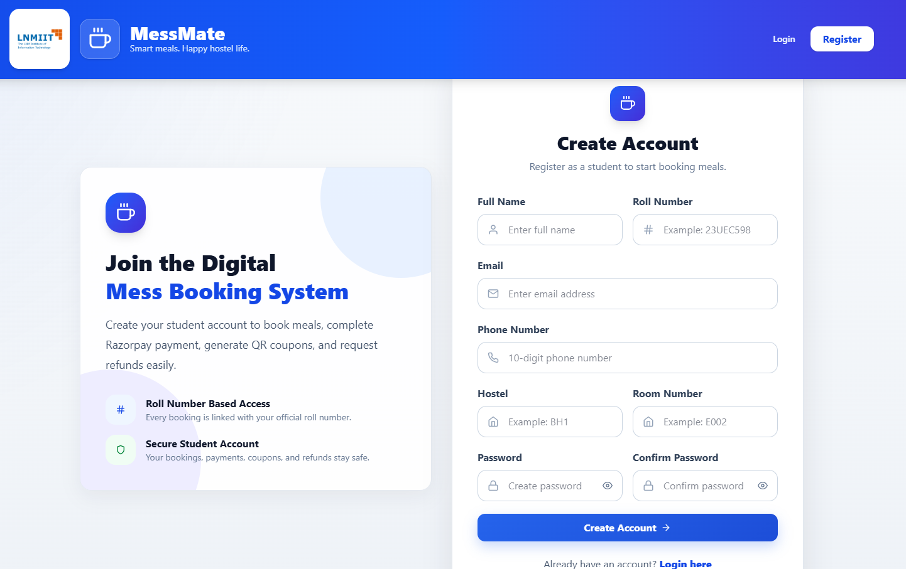
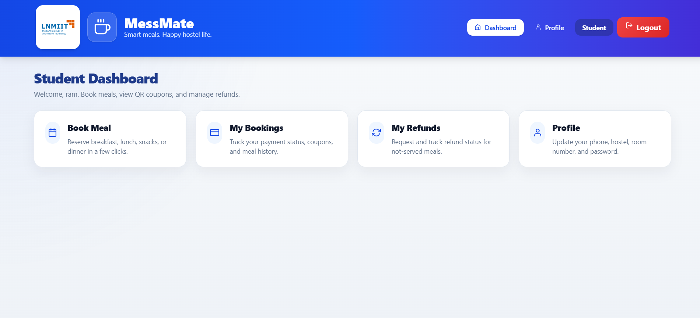
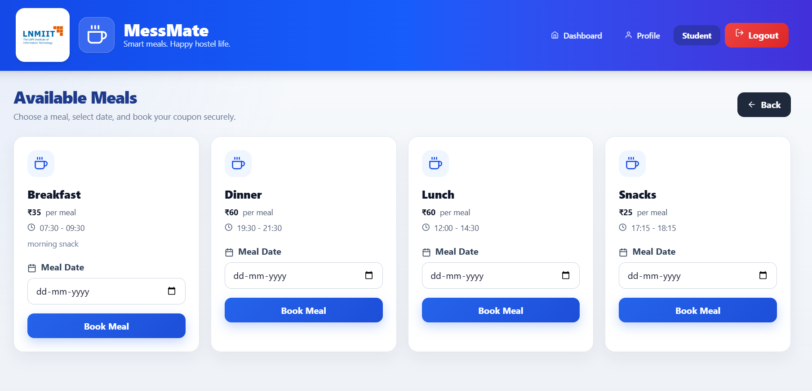
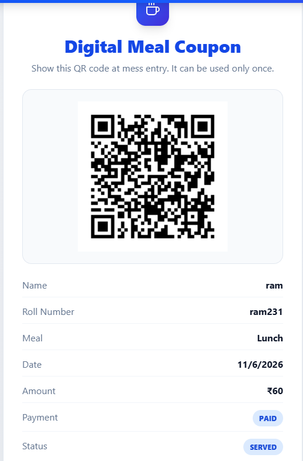
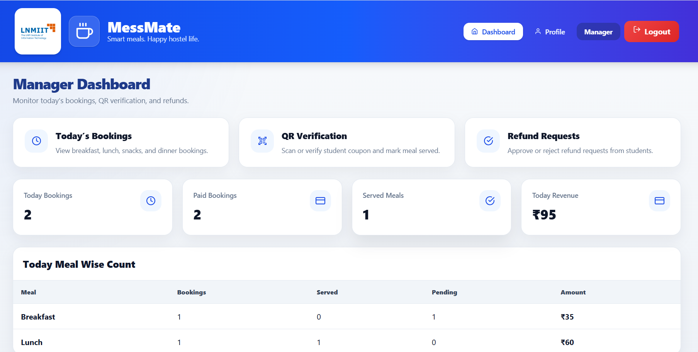
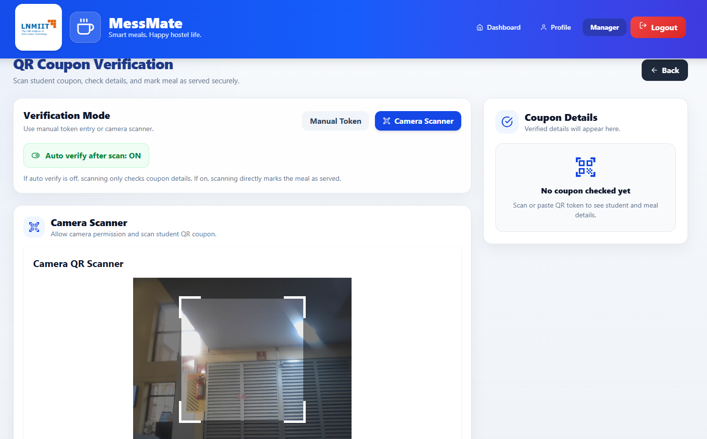
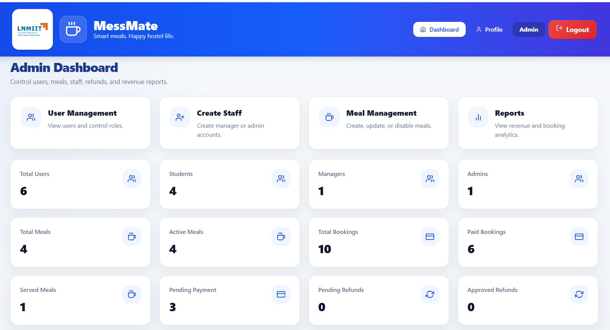

# 🍽️ Mess Coupon Booking System


<p align="center">

A full-stack digital mess coupon booking system designed to help hostel students book meals online, pay securely, generate QR coupons, and verify meal entry digitally.

</p>

<p align="center">

💻 Built for hostel mess management to replace paper coupons with a secure and modern digital meal booking, payment, QR verification, and refund system.

</p>

---

# 🌐 Live Demo

Frontend
https://digital-mess-meal-booking-system.vercel.app

Backend API
https://digital-mess-meal-booking-system.onrender.com

---

# 📸 Screenshots

## 🏠 Home Page

<p align="center">

</p>

---

## 🔐 Login Page

<p align="center">

</p>

---

## 📝 Register Page

<p align="center">

</p>

---

## 🎓 Student Dashboard

<p align="center">

</p>

---

## 🍽️ Book Meal Page

<p align="center">

</p>

---

## 🎫 Digital QR Coupon Page

<p align="center">

</p>

---

## 🧑‍💼 Manager Dashboard

<p align="center">

</p>

---

## 📷 QR Verification Page

<p align="center">

</p>

---

## 🛠️ Admin Dashboard

<p align="center">

</p>

---


# ✨ Features

### 🍽️ Digital Meal Booking

Students can book breakfast, lunch, snacks, and dinner online without standing in long queues.

### 💳 Razorpay Payment Integration

Secure Razorpay test payment integration for online meal payment and payment verification.

### 🎫 QR Coupon Generation

After successful payment, a unique QR coupon is generated for the booked meal.

### 📷 QR Coupon Verification

Managers can scan or manually verify QR coupons at the mess entry counter.

### 🔁 Payment Retry System

If payment is failed, cancelled, or interrupted, the student can retry payment from the My Bookings page.

### 🧾 Refund Management

Students can request refunds for paid meals that were not served.

### 🧑‍💼 Manager Panel

Managers can view today’s bookings, verify QR coupons, mark meals as served, and handle refund requests.

### 🛠️ Admin Panel

Admin can manage users, staff accounts, meals, reports, and complete system data.

### 📊 Reports and Revenue Tracking

Admin can view meal-wise and date-wise reports with booking count, served meals, refunds, and revenue.

### 🔐 Authentication System

Secure login and registration using JWT authentication and role-based access control.

---

# 🛠 Tech Stack

## Frontend

<p>


</p>

* React.js
* Vite
* Tailwind CSS
* Axios
* React Router DOM
* React Icons
* QR Scanner

---

## Backend

<p>


</p>

* Node.js
* Express.js
* MongoDB Atlas
* Mongoose
* JWT Authentication
* Bcrypt.js
* Razorpay API
* QR Code Generator

---

## Deployment

<p>


</p>

* Frontend → Vercel
* Backend → Render
* Database → MongoDB Atlas
* Keep Alive Monitor → UptimeRobot
* Version Control → GitHub

---

# 👥 User Roles

| Role    | Access                                                           |
| ------- | ---------------------------------------------------------------- |
| Student | Book meals, pay online, view QR coupon, request refund           |
| Manager | View bookings, verify QR, mark served/not served, manage refunds |
| Admin   | Manage users, staff, meals, reports, and system data             |

---

# 🔄 System Flow

## Student Meal Booking Flow

```text
Student Login
↓
View Available Meals
↓
Select Meal and Date
↓
Book Meal
↓
Pay with Razorpay
↓
Payment Verified
↓
QR Coupon Generated
↓
Show QR at Mess Entry
↓
Manager Verifies QR
↓
Meal Marked as Served
```

---

## Refund Flow

```text
Student Requests Refund
↓
Manager/Admin Reviews Request
↓
Approve or Reject Refund
↓
Refund Status Updated
↓
Student Can Track Refund
```

---

# 💳 Payment Handling

This project uses **Razorpay Test Mode** for safe payment testing.

In test mode:

* No real money is deducted
* No real money is transferred
* No settlement happens
* No transaction charge is applied

The system supports payment retry if:

* Student closes Razorpay popup
* Internet disconnects during payment
* Payment fails
* Payment is left incomplete

In such cases, the booking remains in `PENDING_PAYMENT` or `FAILED` status, and the student can retry payment from the My Bookings page.

---

# 🎫 QR Coupon System

After successful payment, the system generates:

* Unique QR token
* QR code image
* Digital meal coupon
* Meal details
* Student details
* Payment and booking status

The QR coupon is single-use and can be verified only once by the manager.

---

# 📂 Project Structure

```bash
Mess-Coupon-Booking-System
│
├── backend
│   ├── config
│   │   ├── db.js
│   │   └── razorpay.js
│   │
│   ├── controllers
│   │   ├── authController.js
│   │   ├── bookingController.js
│   │   ├── paymentController.js
│   │   ├── refundController.js
│   │   ├── userController.js
│   │   ├── mealController.js
│   │   └── dashboardController.js
│   │
│   ├── middleware
│   │   ├── authMiddleware.js
│   │   └── roleMiddleware.js
│   │
│   ├── models
│   │   ├── User.js
│   │   ├── Meal.js
│   │   ├── Booking.js
│   │   └── Refund.js
│   │
│   ├── routes
│   │   ├── authRoutes.js
│   │   ├── bookingRoutes.js
│   │   ├── paymentRoutes.js
│   │   ├── refundRoutes.js
│   │   ├── userRoutes.js
│   │   ├── mealRoutes.js
│   │   └── dashboardRoutes.js
│   │
│   ├── utils
│   │   ├── qrUtils.js
│   │   ├── validators.js
│   │   └── dateTimeUtils.js
│   │
│   ├── server.js
│   └── package.json
│
├── frontend
│   ├── public
│   │   └── messmate-logo.png
│   │
│   ├── src
│   │   ├── api
│   │   │   └── api.js
│   │   │
│   │   ├── assets
│   │   │   ├── lnmiit-logo.png
│   │   │   ├── developer.jpg
│   │   │   ├── food-breakfast.jpg
│   │   │   ├── foodlunch.jpg
│   │   │   ├── food-snacks.jpg
│   │   │   └── food-dinner.jpg
│   │   │
│   │   ├── components
│   │   │   ├── Navbar.jsx
│   │   │   ├── ProtectedRoute.jsx
│   │   │   ├── PageHeader.jsx
│   │   │   ├── StatusBadge.jsx
│   │   │   └── QRScanner.jsx
│   │   │
│   │   ├── context
│   │   │   └── AuthContext.jsx
│   │   │
│   │   ├── pages
│   │   │   ├── Home.jsx
│   │   │   ├── Login.jsx
│   │   │   ├── Register.jsx
│   │   │   ├── StudentDashboard.jsx
│   │   │   ├── AvailableMeals.jsx
│   │   │   ├── MyBookings.jsx
│   │   │   ├── MyCoupon.jsx
│   │   │   ├── MyRefunds.jsx
│   │   │   ├── ManagerDashboard.jsx
│   │   │   ├── TodayBookings.jsx
│   │   │   ├── QRVerification.jsx
│   │   │   ├── RefundRequests.jsx
│   │   │   ├── AdminDashboard.jsx
│   │   │   ├── UserManagement.jsx
│   │   │   ├── CreateStaff.jsx
│   │   │   ├── MealManagement.jsx
│   │   │   ├── Reports.jsx
│   │   │   └── Profile.jsx
│   │   │
│   │   ├── utils
│   │   │   └── loadRazorpay.js
│   │   │
│   │   ├── App.jsx
│   │   ├── main.jsx
│   │   └── index.css
│   │
│   ├── index.html
│   └── package.json
│
├── screenshots
│   ├── home.png
│   ├── login.png
│   ├── register.png
│   ├── student-dashboard.png
│   ├── book-meal.png
│   ├── my-bookings.png
│   ├── coupon.png
│   ├── manager-dashboard.png
│   ├── qr-verification.png
│   ├── admin-dashboard.png
│   ├── user-management.png
│   ├── meal-management.png
│   └── reports.png
│
└── README.md
```

---

# ⚙️ Installation & Setup

## 1️⃣ Clone Repository

```bash
git clone https://github.com/RACHIT7409/digital-mess-meal-booking-system.git
cd mess-coupon-booking-system
```

---

## 2️⃣ Backend Setup

```bash
cd backend
npm install
```

### Create `.env` file

```env
PORT=5000
NODE_ENV=development

MONGO_URI=your_mongodb_atlas_connection_string

JWT_SECRET=your_jwt_secret
JWT_EXPIRE=7d

FRONTEND_URL=http://localhost:5173

RAZORPAY_KEY_ID=your_razorpay_key_id
RAZORPAY_KEY_SECRET=your_razorpay_key_secret
RAZORPAY_WEBHOOK_SECRET=your_razorpay_webhook_secret
```

### Run Backend

```bash
npm run dev
```

Backend will run on:

```bash
http://localhost:5000
```

---

## 3️⃣ Frontend Setup

```bash
cd frontend
npm install
```

### Create `.env` file

```env
VITE_API_BASE_URL=http://localhost:5000/api
```

### Run Frontend

```bash
npm run dev
```

Frontend will run on:

```bash
http://localhost:5173
```

---

# 🔐 Authentication Flow

1. User registers or logs in
2. Backend verifies credentials
3. Backend generates JWT token
4. Token is stored in localStorage
5. Protected routes require valid token
6. Role-based access controls student, manager, and admin pages

---

---

# 🚀 Deployment

## Frontend Deployment on Vercel

1. Push code to GitHub
2. Open Vercel
3. Import GitHub repository
4. Select frontend root directory
5. Add environment variable:

```env
VITE_API_BASE_URL=https://digital-mess-meal-booking-system.onrender.com/api
```

6. Deploy

---

## Backend Deployment on Render

1. Push code to GitHub
2. Open Render
3. Create Web Service
4. Select backend root directory
5. Add environment variables
6. Build command:

```bash
npm install
```

7. Start command:

```bash
npm start
```

8. Deploy

---

## MongoDB Atlas Setup

1. Create MongoDB Atlas account
2. Create free cluster
3. Create database user
4. Allow network access
5. Copy MongoDB connection string
6. Add it to backend `.env`

---

## UptimeRobot Keep Alive

Render free backend can sleep after inactivity.
To reduce cold start delay:

1. Create UptimeRobot account
2. Create HTTP monitor
3. Add backend Render URL:

```bash
https://digital-mess-meal-booking-system.onrender.com
```

4. Set monitoring interval to 5 minutes
5. Keep monitor active

---

# 🧪 Testing Flow

Use this flow to test the complete project:

```text
1. Register as student
2. Login as student
3. View available meals
4. Book a meal
5. Pay using Razorpay test mode
6. View generated QR coupon
7. Login as manager
8. Verify QR coupon
9. Mark meal as served
10. Login as admin
11. Check dashboard and reports
```

---

---

# 🚀 Future Improvements

* Email notifications after booking and payment
* Forgot password feature
* Meal capacity limit
* Daily menu image upload
* Monthly revenue analytics
* Admin charts and graphs
* Student wallet system
* Bulk student upload
* SMS notification
* Progressive Web App support
* Mobile app version

---

# 🤝 Contributing

Contributions are welcome.

1. Fork the repository
2. Create a new branch

```bash
git checkout -b feature-name
```

3. Commit your changes

```bash
git commit -m "Added new feature"
```

4. Push to branch

```bash
git push origin feature-name
```

5. Open a Pull Request

---

## When You Update Your Code

Use this command sequence to push updated code into GitHub:

```bash
git add .
git commit -m "Update project"
git pull origin main --rebase
git push origin main
```

After pushing:

```text
Frontend auto-updates on Vercel ✅
Backend auto-updates on Render ✅
```

---

# 📜 License

This project is licensed under the **MIT License**.

---

# 👨‍💻 Author

**RACHIT CHAWLA**

GitHub
https://github.com/RACHIT7409

Email
[23uec598@lnmiit.ac.in](mailto:23uec598@lnmiit.ac.in)

---

# ⭐ Support

If you like this project, please give it a ⭐ on GitHub.

It helps others discover the project.
